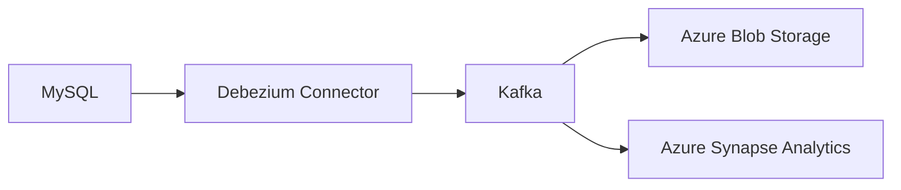

# 변경 데이터 캡처 (CDC: Change Data Capture)

## 1. CDC란?

**CDC(Change Data Capture)**는 데이터베이스에서 발생하는 데이터 변경 사항(삽입, 수정, 삭제)을 실시간 또는 주기적으로 감지하고, 이를 다른 시스템으로 전파하거나 분석에 활용할 수 있도록 해주는 기술입니다.

CDC는 파이프라인이 마지막으로 실행된 이후 _변경된 데이터만_ 처리하므로 작업이 더 효율적이고 효과적입니다.

---

### ✅ 왜 CDC를 사용하는가?

#### [AS-IS]

- 기존에는 매일 **60일치 데이터를 반복적으로 덮어씀** → 비효율

#### [TO-BE]

CDC는 변경된 데이터만 추출하므로 다음과 같은 이점이 있습니다:

- **변경 부분만 반영 (성능 향상)**: 전체 데이터를 다시 로드하지 않고 변경된 부분만 반영
- **실시간 처리 가능**: 스트리밍 파이프라인과 연계하여 실시간 분석 가능
- **리소스 절약**: 네트워크 / 스토리지 비용 감소
- **데이터 일관성 유지**: 실시간 동기화로 데이터 품질 향상

---

### 🔧 동작 원리

> 💡 **Source DB의 로그를 읽어 Target으로 데이터를 이관**

| 방식            | 설명                               | 예시                                 |
| --------------- | ---------------------------------- | ------------------------------------ |
| 트리거 기반     | DB 트리거를 사용해 변경사항 기록   | INSERT / UPDATE / DELETE 트리거 설정 |
| 로그 기반       | 트랜잭션 로그(binlog 등) 분석      | MySQL binlog, SQL Server CDC         |
| 타임스탬프 비교 | 변경 시간 컬럼 기반 비교           | `last_modified` 컬럼 활용            |
| 해시 비교       | 행의 해시값을 비교해 변경사항 감지 | 주기적 해시 계산 후 비교             |

---

## 2. CDC 적용 예시 (MySQL → Azure)

MySQL의 CDC 기능을 활용하여 Azure 환경으로 변경 데이터를 수집하고 저장 및 분석하는 아키텍처 구성은 다음과 같습니다:

### 📌 아키텍처 구성



---

## 3. MySQL CDC 구성

MySQL에서는 **Binary Log (binlog)** 를 통해 CDC를 구현할 수 있습니다.

### 3.1 binlog 설정 예시

```ini
[mysqld]
server-id=1
log-bin=mysql-bin
binlog_format=row
binlog_row_image=full
expire_logs_days=7
```

> 설정 후 MySQL 재시작 필요  
> CDC 전용 계정 생성 권장

---

## 4. Azure에서 CDC 수집 구성

Debezium + Kafka를 활용한 **정석적인 CDC 아키텍처**입니다.

### 4.1 구성 흐름

1. Kafka 클러스터 구성 (예: Confluent Cloud / self-hosted / Azure HDInsight)
2. Debezium MySQL Connector 설정 (binlog 실시간 수신)
3. Kafka Sink Connector 설정
   - 예: Azure Blob Storage Sink / Azure SQL DB Sink / Databricks Consumer 등
4. Azure 타겟 구성
   - Azure Blob / Data Lake → 원본 로그 저장
   - Azure Databricks → 스트리밍 처리 및 분석
   - Azure SQL DB → 실시간 데이터 동기화

---

## 📷 적용 예시 이미지


